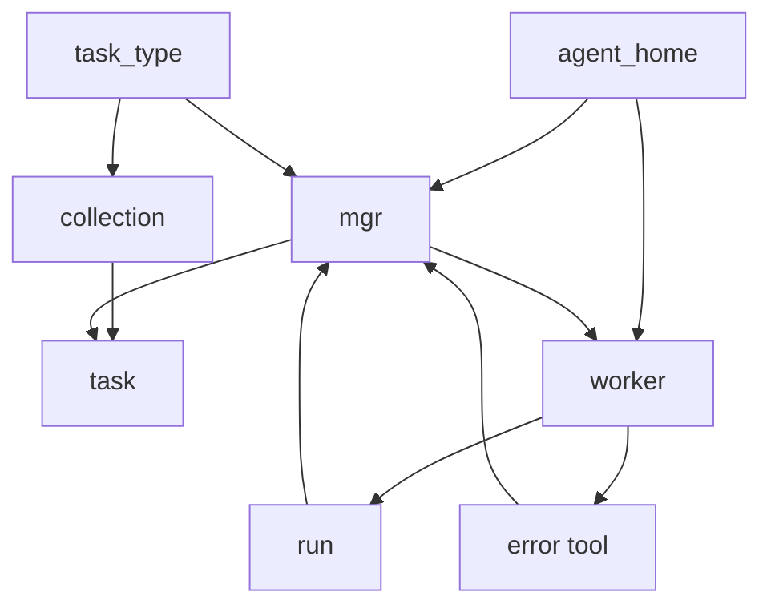
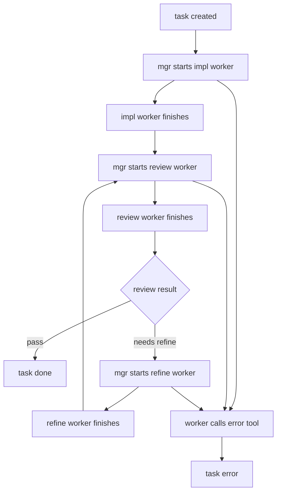

# Task-Type Driven Coding Agent Toolchain Design

## 1. 背景

当前 coding agent 的主流使用方式，仍然接近一次性 prompt 驱动：人类程序员描述目标、补充上下文、观察输出、继续追问、要求返工、手工判断是否完成。

这个模式在单个任务上可用，但面对一批同类型任务时，会出现明显问题：

* 每个 agent 被塞入过多能力，工具、权限、上下文、判断空间过宽，导致行为发散。
* 每个任务都依赖人工重新组织 prompt，过程繁琐且不可复用。
* 同类任务的推进过程高度相似，但没有被沉淀成可复用的任务协议。
* 如果用传统代码框架实现所有状态调度、异常处理、返工策略和任务编排，系统会快速膨胀成复杂 workflow engine。
* coding agent 的工作产物非常动态，可能是 diff、commit、未提交代码、一段说明、一段实现代码、一次文件修改、一次测试运行，不能假设所有任务都有固定结构化制品。

因此，这个工具链要解决的问题不是“让 agent 更聪明”，也不是“替代人类软件工程流程”，而是：

**把人类程序员已有的 vibe coding 工作流，提升为可批量推进、可复用、可中断恢复的 agentic task workflow。**

本工具链不发明新的研发流程。它只把人类已经能用 coding agent 半自动完成的工作，抽象成可重复调用的 task_type、collection、mgr、worker 和 run。

如果某类工作原本就无法通过 coding agent 作为语义胶水完成自动化，那么工具链级别不会替它承载复杂性。

---

## 2. 设计定位

本系统是 **coding agent workflow toolchain**，不是企业级工作流平台。

它的定位是：

```text
用最小框架承载任务边界、状态流转和 agent 调度；
用 mgr agent 作为编排胶水，避免在框架层硬编码大量 task_type 专属逻辑；
用 worker agent 执行具体任务；
用 task_type 沉淀同类任务的推进方式。
```

本系统不追求：

* 高性能调度
* 分布式执行
* 强一致事务
* 企业权限模型
* 完整可验证工作流
* 强结构化 artifact schema
* 替代 CI/CD
* 替代人类 review
* 替代软件工程管理系统

本系统追求：

* 低 ceremony
* 低框架复杂度
* task_type 可复用
* agent_home 可替换
* mgr 编排层足够薄
* worker 执行足够自由
* 适合个人或小团队增强 coding agent 工作流

---

## 3. 高层设计原则

### 3.1 工具链优先，不做平台

系统必须保持工具链形态。

工具链只提供足够的抽象，让用户把一批相似 coding tasks 交给 agent 持续推进。它不承担企业应用系统该承担的完整治理、权限、审计、审批、强校验和复杂可视化。

设计上必须避免把系统做成通用 workflow engine。

---

### 3.2 框架层做薄，mgr 作为编排胶水

框架不负责穷尽所有 task_type 的状态调度逻辑。

不同 task_type 的推进方式差异很大。如果在框架层为每种任务实现完整调度逻辑，会导致系统复杂度快速失控。

因此，唯一设计是：

```text
Framework = thin substrate
Mgr Agent = workflow router
Worker Agent = task executor
```

框架只提供：

* task_type
* collection
* task
* run
* agent_home
* worker invocation
* state transition record
* error exit

mgr 负责根据 task_type 的编排 prompt 和当前 task 状态，选择下一个 worker 并推动任务流转。

---

### 3.3 mgr 不做裁决，只做流转

mgr 不是 reviewer。

mgr 不负责判断代码是否正确，不负责解释实现质量，不负责决定一个复杂语义结果是否满足需求。

mgr 的职责只有一个：

**根据 task_type 定义的流程和 worker 的执行结果，推动 task 状态流转。**

例如：

```text
todo -> impl_worker
impl_worker completed -> review_worker
review_worker completed -> refine_worker or done
refine_worker completed -> review_worker
worker error -> task error
```

mgr 可以是 coding agent，但它作为 agent 的价值不在于语义裁决，而在于用自然语言规则完成轻量编排，避免框架硬编码复杂状态机。

---

### 3.4 worker 完成即 task 阶段完成

系统层不解释 worker 的产物。

在工具链级别，worker 执行完毕就代表当前阶段完成。系统不要求 worker 必须返回固定结构化 artifact，也不在框架层解析 worker 产物来判断任务是否完成。

唯一允许的异常出口是：

```text
worker 调用 error tool
```

也就是说：

* worker 正常结束：阶段完成，mgr 继续流转。
* worker 调用 error tool：阶段失败，task 进入 error 状态或由 mgr 按 task_type 规则处理。

除此之外，框架不做额外判定。

---

### 3.5 worker 产物默认动态，不做工具链级强结构化

coding worker 的产物高度动态。

它可能是：

* 一段实现代码
* 一组文件修改
* 未提交代码
* 一个 commit
* 一段 review comment
* 一段失败说明
* 一次测试输出
* 一个 patch
* 一个新的任务建议

工具链级别不强制所有产物结构化。

如果某个 task_type 需要结构化输出，应该在该 task_type 的编排 prompt 或 worker prompt 中明确要求，而不是在工具链核心模型中强制。

原则是：

```text
结构化是 task_type 的约束，不是工具链的全局约束。
```

---

### 3.6 task_type 是复用单位

系统的核心复用单位不是 task，而是 task_type。

一个 task_type 描述一类任务如何推进。

例如：

* impl
* bugfix
* code-review
* refactor
* doc-update
* test-generation
* migration

同一个 task_type 下可以有多个 collection，每个 collection 中可以有多个 task。

系统关注的是：

```text
很多同类型 task 的推进过程高度类似，应该复用同一套 task_type workflow。
```

---

### 3.7 不替代人类工作流，只增强已有工作流

本工具链不是为了重新定义软件研发流程。

它假设用户已经知道如何使用 coding agent 完成某类工作，只是当前过程太手工、太一次性、太依赖聊天上下文。

工具链要做的是把这类已存在的人工 agent workflow 沉淀下来。

如果某个工作流无法通过 coding agent 这种语义胶水合理自动化，工具链不负责把它变得可自动化。

---

## 4. 核心模型

唯一核心模型如下：

```text
agent_home
  -> mgr
  -> worker

task_type
  -> collection
  -> task
  -> run
```

系统关系：



解释：

* `agent_home` 定义 agent 的能力、工具、instruction 和运行环境。
* `task_type` 定义同类任务的推进方式。
* `collection` 是某个 task_type 下的一批任务。
* `task` 是 collection 中的一个具体任务。
* `mgr` 是某个 task_type 的编排 agent。
* `worker` 是由 mgr 拉起的执行 agent。
* `run` 是 worker 的一次执行记录。
* `error tool` 是 worker 唯一失败出口。

---

## 5. 核心概念设计

### 5.1 agent_home

`agent_home` 是 agent runtime profile。

它定义 agent 如何运行，而不是定义业务任务本身。

它包含：

* agent instruction
* 可用工具
* 权限边界
* 工作目录约定
* 上下文读取方式
* 输出风格要求

系统允许存在多个 agent_home。

mgr 和 worker 都从 agent_home 实例化。

唯一设计：

```text
mgr 使用 mgr_home
worker 使用 worker_home
不同 task_type 可以绑定不同 mgr_home 和 worker_home
```

目的：

```text
通过 agent_home 收敛 agent 能力，避免一个 agent 拥有过宽工具和过宽责任。
```

---

### 5.2 task_type

`task_type` 是同类任务的推进协议。

它不只是分类标签。

它定义：

* 这个任务类型使用哪个 mgr
* mgr 可以调用哪些 worker
* worker 的调用顺序
* worker 正常结束后任务如何流转
* worker 调用 error tool 后任务如何处理
* 需要传递给 worker 的上下文

`task_type` 不定义全局 artifact schema。

如果该 task_type 需要某个 worker 产出结构化结果，要求写在该 task_type 的 prompt 中。

唯一设计：

```text
task_type 负责 workflow prompt，不负责框架级强 schema。
```

---

### 5.3 collection

`collection` 是某个 task_type 下的一批同类任务。

它不是通用项目管理列表，而是同类任务的状态池。

例如：

```text
task_type: impl
collection: user-auth-feature
```

其中可以包含：

* 实现 password login
* 实现 refresh token
* 实现 logout
* 补充 auth tests
* 更新 auth docs

collection 的价值是让 mgr 可以持续推进一批相似任务，而不是只处理单个 task。

唯一设计：

```text
mgr 每次围绕 collection 推进 task，而不是围绕孤立 task 工作。
```

---

### 5.4 task

`task` 是 collection 中的具体推进单元。

它只需要表达：

* 要做什么
* 属于哪个 collection
* 当前处于哪个流程位置
* 最近一次 run 的结果
* 是否进入 error

task 不承担复杂制品模型。

task 的完成不由框架分析产物决定，而由 task_type workflow 推进到完成态决定。

---

### 5.5 mgr

`mgr` 是 task_type 专属编排 agent。

mgr 的唯一职责：

```text
根据 task_type workflow，推动 collection 中的 task 进入下一个 worker 或完成状态。
```

mgr 不做：

* 代码质量裁决
* 需求正确性裁决
* 测试结果语义解释
* diff 深度审查
* artifact schema 校验
* 企业级流程治理

mgr 可以读 worker 的输出，但不是为了做复杂裁决，而是为了完成轻量编排。

例如 review worker 可以明确写出：

```text
review passed
```

或者：

```text
review failed, needs refine
```

mgr 根据这个结果流转任务。

如果需要更严格的结构化结果，由 task_type prompt 要求 review worker 输出指定格式，而不是由工具链核心强制。

---

### 5.6 worker

`worker` 是实际执行者。

worker 可以是：

* impl worker
* review worker
* refine worker
* test worker
* doc worker
* migration worker

worker 的工作方式由其 agent_home 和 task_type prompt 决定。

工具链不限制 worker 的正常产物形态。

唯一硬规则：

```text
worker 如果无法完成当前阶段，必须调用 error tool。
```

这使工具链可以用一个非常简单的机制处理失败：

* 没有 error：阶段完成。
* 有 error：阶段失败。

---

### 5.7 run

`run` 是 worker 的一次执行记录。

它记录：

* 哪个 task
* 哪个 worker
* 何时开始
* 何时结束
* 是否调用 error tool
* worker 输出位置

run 不要求产物结构化。

run 的目的不是提供强验证，而是提供基本可追踪性。

---

### 5.8 error tool

`error tool` 是 worker 唯一失败出口。

worker 正常结束时，系统认为当前阶段完成。

worker 无法完成时，必须显式调用 error tool。

error tool 至少表达：

* 当前 worker 无法完成
* 原因说明
* 建议下一步，可选

工具链只关心是否 error，不对 error 做复杂分类。

---

## 6. 标准任务流

以 `impl` task_type 为例，唯一标准流如下：

```text
task created
  -> mgr starts impl worker
  -> impl worker finishes
  -> mgr starts review worker
  -> review worker finishes
  -> if review says pass: task done
  -> if review says needs refine: mgr starts refine worker
  -> refine worker finishes
  -> mgr starts review worker again
  -> repeat until done or worker calls error tool
```

图示：



这里的重点是：

* mgr 不判断实现质量。
* review worker 负责表达 review 结果。
* refine worker 接收原始任务、已有产物、review 记录继续修正。
* worker 正常结束即阶段完成。
* 失败只通过 error tool 表达。

---

## 7. 编排 prompt 的地位

本系统把复杂性放在 task_type 的编排 prompt 中，而不是放在工具链框架中。

对于不同 task_type，可以通过 prompt 指定：

* mgr 如何选择 worker
* worker 之间传递哪些上下文
* review worker 如何表达 pass / needs refine
* refine worker 接收哪些输入
* 何时停止迭代
* 何时调用 error tool

但这些要求属于 task_type 级别，不进入工具链核心模型。

唯一原则：

```text
工具链只提供运行容器；
task_type prompt 定义编排语义；
worker prompt 定义执行语义。
```

---

## 8. 工具链边界

本工具链不会替用户保证：

* 代码一定正确
* review 一定准确
* 任务拆分一定合理
* 所有 workflow 都能自动化
* worker 输出一定结构化
* agent 不会误判
* 多轮 refine 一定收敛

这些不是工具链级别应该承担的职责。

工具链只保证：

* task_type 可以复用
* collection 可以批量推进
* mgr 可以调度 worker
* worker 可以正常结束或显式报错
* run 可以被记录
* task 可以根据 workflow 流转

---

## 9. 与过度设计的分界

以下设计不进入核心工具链：

* 全局 artifact schema
* 强制 evidence model
* 复杂 review object
* 通用 DAG workflow engine
* 多级审批
* 复杂状态机 DSL
* 强一致任务锁
* 企业级审计
* 复杂权限系统
* worker 输出解析框架

原因：

这些设计会把工具链推向企业平台，偏离最初目标。

本系统要增强的是人类程序员的 vibe coding 工作流，不是替代完整软件工程平台。

---

## 10. 设计结论

最终设计唯一收敛为：

```text
一个 task_type-driven coding agent workflow toolchain。
```

它的核心是：

```text
task_type 复用同类任务推进方式
collection 承载一批同类任务
mgr agent 做轻量编排胶水
worker agent 做具体执行
run 记录一次 worker 执行
error tool 作为唯一失败出口
```

最重要的设计判断是：

```text
mgr 是 coding agent，但 mgr 不做复杂裁决；
mgr 的存在是为了让编排层变薄，避免框架硬编码大量 task_type 状态调度逻辑。
```

worker 的产物默认动态，不在工具链级别强结构化。

如果需要结构化，应该由 task_type prompt 或 worker prompt 指定。

本工具链只做一件事：

**把人类已经能通过 coding agent 推进的同类任务流程，沉淀为可复用、可批量推进的轻量 agent workflow。**

