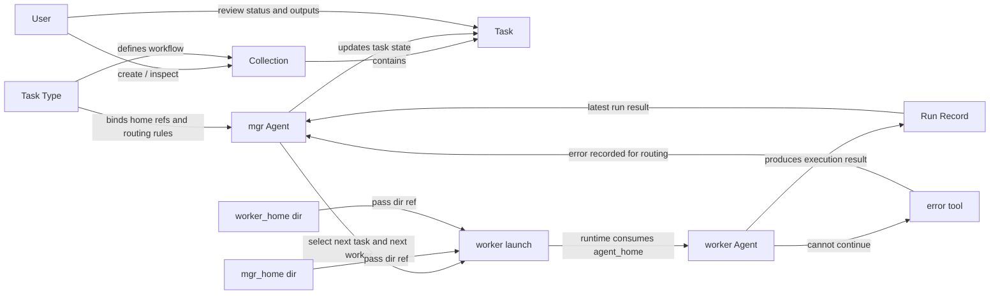
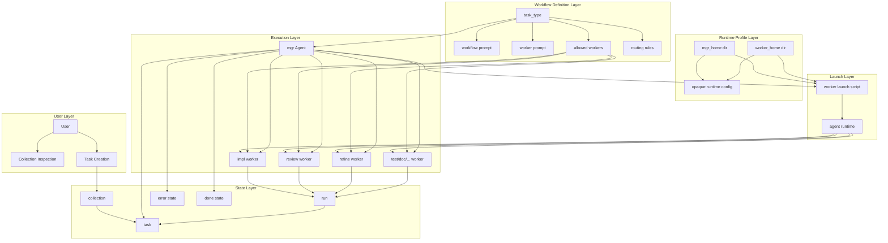
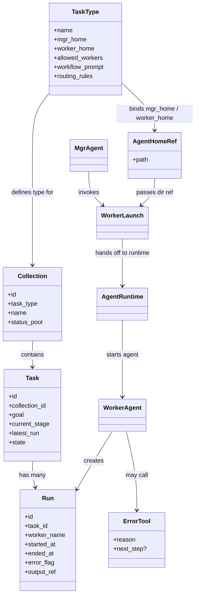
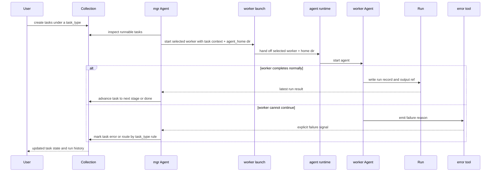
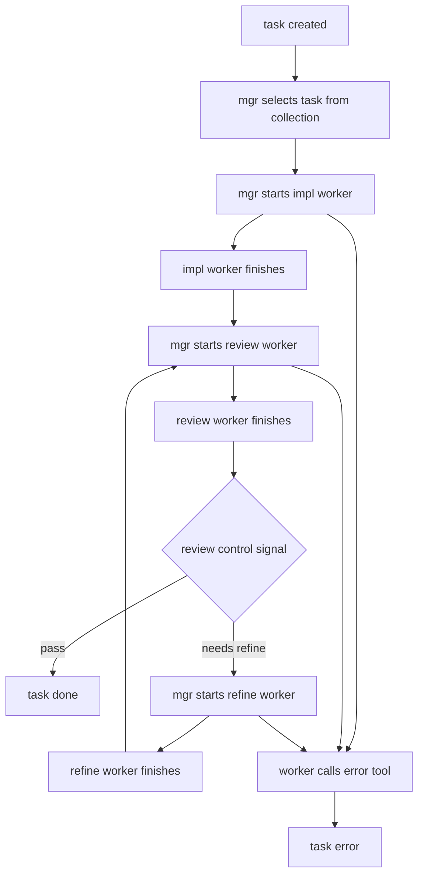
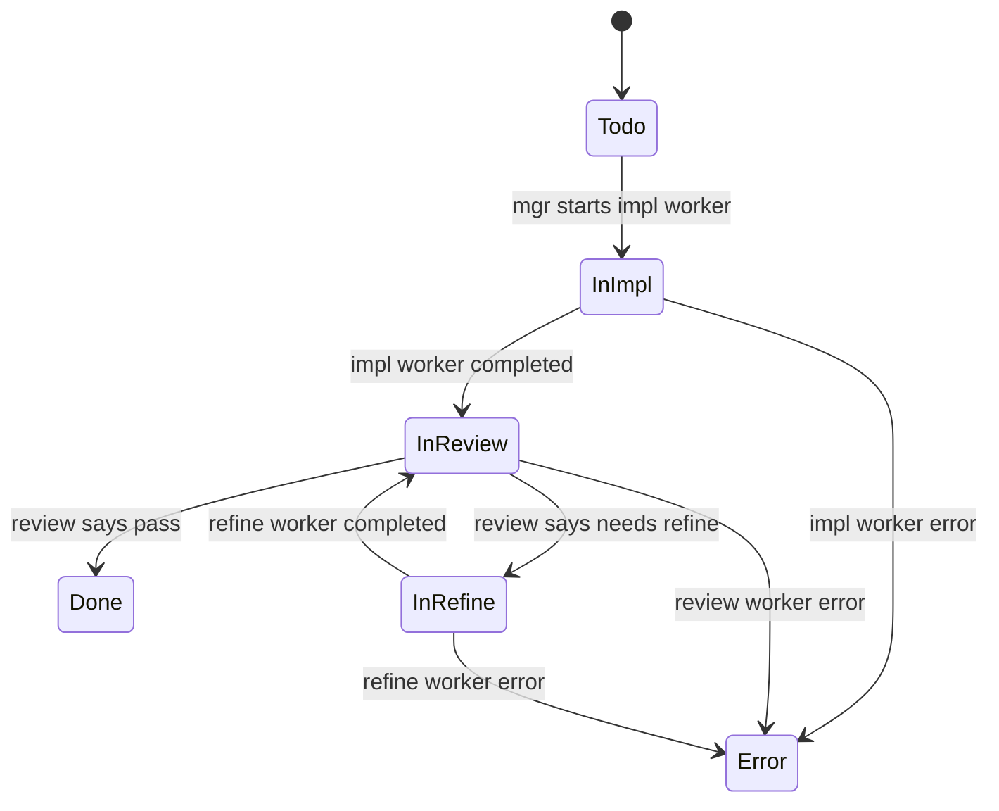
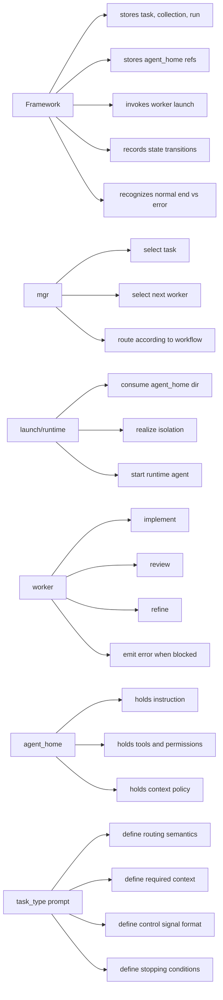

# Task-Type Driven Coding Agent Toolchain Architecture

> 本文档基于 `design.md` 的设计理念，对系统架构进行图示化整理。
> 它是“理解版架构图”，用于审阅设计是否表达准确，不替代正式规范。

## 1. 设计目标

系统的目标不是构建一个通用 workflow engine，而是提供一个足够薄的工具链，让一批同类型的 coding agent 任务可以被持续推进、复用和恢复。

它建立在一个背景前提之上：现代 coding agent runtime 往往已经能通过某种 `agent_home` 或等价目录承载 instruction、tools、permissions、context policy。工具链利用这一既有前提，但不介入其内部设计。

核心判断：

* `task_type` 是复用单位
* `collection` 是同类任务池
* `task` 是具体推进单元
* `mgr` 负责轻量编排
* `worker` 负责具体执行
* `task` 会落地为一串 `worker launch -> run`
* `run` 记录 task 上一次 worker 执行
* `error tool` 是唯一显式失败出口

---

## 2. 系统总览



这个总览表达的是：

* 框架只承载任务对象、agent_home 引用、worker launch 和 run 记录
* `mgr` 不直接做实现工作，只做路由和状态推进
* 工具链不解释 `agent_home` 目录内部语义，只把它传给 launch 机制
* `worker` 既可以产出代码，也可以产出 review/refine/test/doc 结果
* 成功路径依赖 worker 正常结束，失败路径依赖 `error tool`

---

## 3. 分层架构



分层含义：

* `Workflow Definition Layer` 承载任务类型差异
* `Runtime Profile Layer` 只表示 runtime 可消费的 home 目录，不由工具链解释
* `Launch Layer` 负责把 `agent_home` 目录真正变成可运行 agent
* `Execution Layer` 只负责推进和执行
* `State Layer` 只负责记录和流转，不负责深度解释产物

---

## 4. 核心对象关系



我对对象关系的理解是：

* `TaskType` 是协议对象，不是纯标签
* `Collection` 是调度上下文，不是通用项目管理容器
* `Task` 是状态机实例
* `Run` 是 task 上的一次 worker 执行事件
* `AgentHomeRef` 在工具链里只是目录引用，不是能力模型
* agent 能力和隔离由 launch/runtime 负责，不由工具链负责

---

## 5. 运行时交互图



这个运行时交互图体现两个关键点：

* 框架识别的是“正常结束”与“显式失败”
* `mgr` 读取结果是为了路由，不是为了充当代码质量裁判
* `agent_home` 是 launch/runtime 的输入，不是工具链层解释的对象

---

## 6. 标准 `impl` 任务流



这个任务流对应的是文档中的标准示例：

* `impl worker` 负责第一次实现
* `review worker` 负责给出是否通过的控制信号
* `refine worker` 基于 review 结果继续修正
* 任何阶段都可以通过 `error tool` 终止正常推进

---

## 7. 状态视角



这里的重点不是状态机复杂度，而是状态机足够薄：

* 阶段流转由 `task_type` 决定
* 状态记录由框架承载
* 复杂判定不下沉到框架

---

## 8. 责任边界图



责任边界总结：

* 框架不做 task_type 专属裁决
* `mgr` 不做深度质量审查
* 框架不解释 `agent_home` 内部设计
* `launch/runtime` 负责让 `agent_home` 生效并实现隔离
* `worker` 不负责全局编排
* `task_type prompt` 承载大部分流程语义

---

## 9. 架构收敛点

以下内容是本版文档明确收敛后的表述：

* `collection` 更像“调度上下文”，`task` 才是具体状态机实例
* `task` 最终体现为一串按 task_type 协议推进的 `worker launch -> run`
* `run` 从属于 `task`，并记录本次由哪个 worker 执行
* 工具链虽然不要求统一 artifact schema，但至少需要最小控制信号，例如 `pass` / `needs refine`
* `mgr` 不做业务质量裁决，但会做协议级路由判断
* `agent_home` 在工具链层是不透明目录；agent 能力由其自身和 runtime 管理
* `error tool` 是唯一显式失败出口，但 error 后是否直接终止，仍应由 `task_type` 决定

---

## 10. 一句话架构结论

```text
这是一个以 task_type 为协议中心、以 mgr 为轻量编排器、以 worker 为执行器、
以 collection/task/run 为状态载体、以 worker launch 为运行入口的薄型 coding agent workflow toolchain。
```
